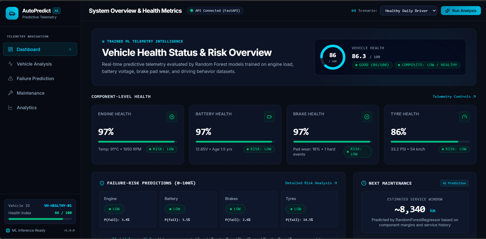
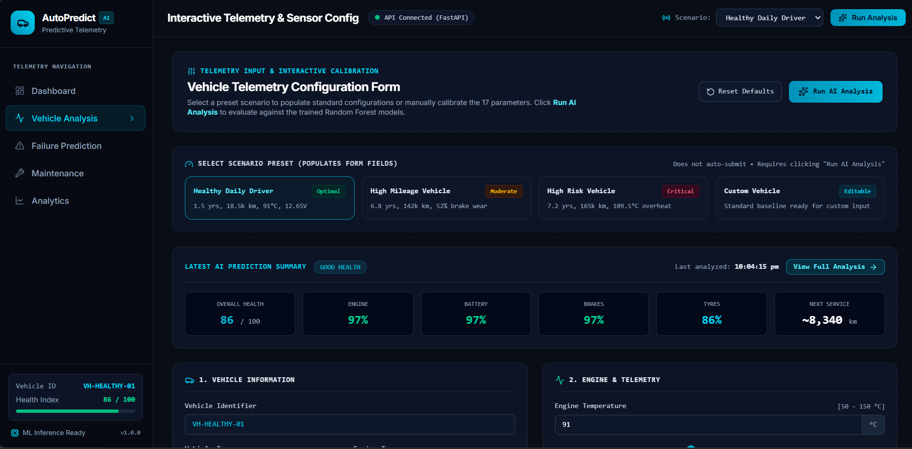
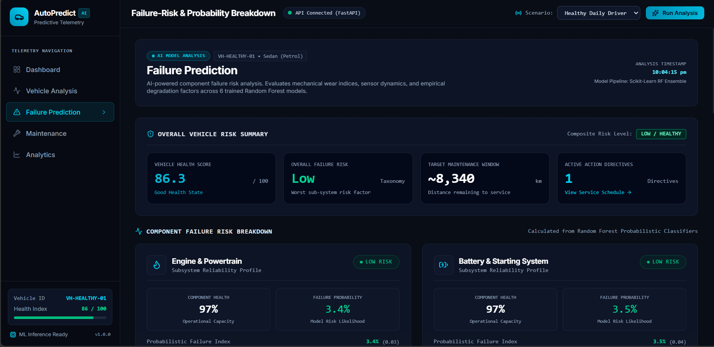
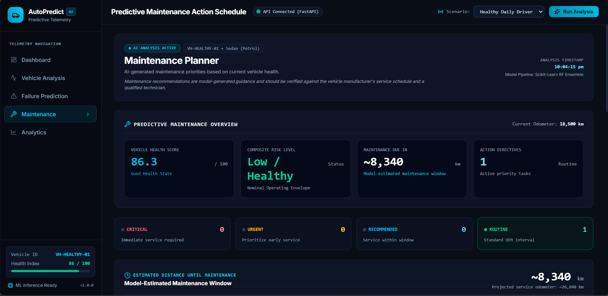
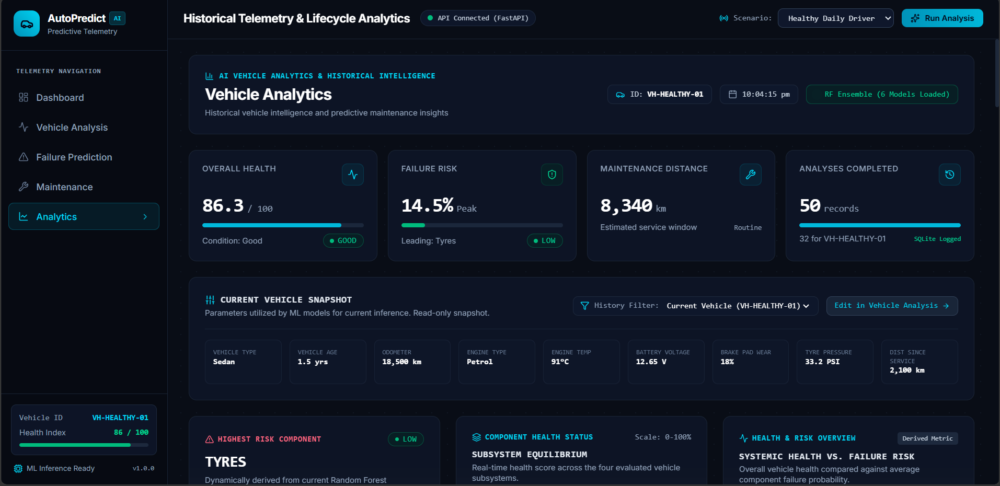

# AutoPredict AI — AI-Powered Vehicle Health & Predictive Maintenance Platform

[](https://www.python.org/)
[](https://fastapi.tiangolo.com/)
[](https://scikit-learn.org/)
[](https://react.dev/)
[](https://vitejs.dev/)
[](https://tailwindcss.com/)
[](https://www.sqlite.org/)

---

## 1. Project Overview

**AutoPredict AI** is an end-to-end full-stack machine learning platform that analyzes vehicle operational telemetry and service history to estimate overall vehicle health, predict component-level failure probabilities, estimate remaining maintenance distance, and generate prioritized service directives.

The platform pairs a **FastAPI** backend orchestrating a multi-model **Random Forest ensemble (6 trained models)** with an interactive, responsive **React + Tailwind CSS** dashboard. Every evaluation persists to an embedded **SQLite** database, powering historical trend analytics and degradation trajectories.

> **Academic & Portfolio Scope**: This platform was developed as an AI/ML portfolio and engineering demonstration project. Training and evaluation utilize a physics-informed **synthetic vehicle telemetry dataset** (~5,000 records). Results demonstrate modern machine learning integration, architectural design, and full-stack software engineering rather than certified production automotive diagnostics.

---

## 2. Key Features

- **Overall Vehicle Health Score (0–100)**: Evaluates systemic vehicle condition using a trained Random Forest regressor.
- **Component-Level Failure Probabilities (0–100%)**: Probabilistic classification across 4 core subsystems:
  - **Engine & Powertrain**
  - **Battery & Electrical System**
  - **Braking System & Friction Surfaces**
  - **Tyres & Wheel Assemblies**
- **Complementary Subsystem Health**: Component health is calculated directly as $\text{Health} = 100 - \text{Failure Probability}$, ensuring strict mathematical consistency.
- **Predictive Maintenance Distance**: Predicts estimated kilometers remaining until next scheduled service interval using regression.
- **Model-Indicated Contributing Factors**: Identifies key operational signals driving failure risk (e.g., terminal resting voltage, brake lining wear, thermal thresholds) based on model feature behaviors.
- **Dynamic Maintenance Directives**: Automatically generates actionable recommendations prioritized by severity (`Critical`, `Urgent`, `Recommended`, `Routine`).
- **Interactive 17-Parameter Calibration**: Form equipped with numeric inputs, range bounds, and tactile sliders for real-time scenario simulation.
- **Pre-Configured Vehicle Presets**: One-click scenario loading for Healthy Daily Driver, High Mileage Vehicle, High Risk Vehicle, and Custom profiles.
- **Historical Telemetry Intelligence**: Embedded SQLite persistence tracking health trends, failure probability evolution, and maintenance window compression over time.
- **Responsive Cockpit Interface**: Built with Tailwind CSS, Recharts visualizations, Lucide icons, and a mobile navigation drawer for desktop, tablet, and mobile displays.

---

## Screenshots

### Dashboard


### Vehicle Analysis


### Failure Prediction


### Maintenance Planner


### Analytics


---

## 3. System Architecture

The end-to-end platform follows a decoupled, data-driven architecture:

```
┌─────────────────────────────────────────────────────────┐
│               User Vehicle Telemetry Inputs             │
│        (17 Operational Sensor & Maintenance Features)   │
└────────────────────────────┬────────────────────────────┘
                             │
                             ▼
┌─────────────────────────────────────────────────────────┐
│                 React Frontend (Vite)                   │
│   • Vehicle Calibration Form • Preset Selector         │
│   • Shared Context State     • Responsive UI Drawer     │
└────────────────────────────┬────────────────────────────┘
                             │  HTTP POST /api/predict
                             ▼
┌─────────────────────────────────────────────────────────┐
│                   FastAPI REST API                      │
│   • Pydantic Request Validation                         │
│   • CORS & Lifecycle Management                         │
└────────────────────────────┬────────────────────────────┘
                             │
                             ▼
┌─────────────────────────────────────────────────────────┐
│                 ML Prediction Service                   │
│   • ColumnTransformer Preprocessing                     │
│     (StandardScaler + OneHotEncoder)                    │
└────────────────────────────┬────────────────────────────┘
                             │
                             ▼
┌─────────────────────────────────────────────────────────┐
│        Scikit-Learn Random Forest Model Ensemble        │
│   ├─ Overall Health Regressor (R² = 0.9507)             │
│   ├─ Maintenance Distance Regressor (R² = 0.9799)       │
│   ├─ Engine Failure Classifier (Acc = 93.5%)            │
│   ├─ Battery Failure Classifier (Acc = 86.9%)           │
│   ├─ Brake Failure Classifier (Acc = 90.0%)             │
│   └─ Tyre Failure Classifier (Acc = 77.0%)              │
└────────────────────────────┬────────────────────────────┘
                             │
                             ▼
┌─────────────────────────────────────────────────────────┐
│       Health, Failure Risk & Maintenance Outputs        │
│   • Probabilities (%)    • Remaining Distance (km)      │
│   • Risk Badges          • Prioritized Action Directives│
└────────────────────────────┬────────────────────────────┘
                             │
              ┌──────────────┴──────────────┐
              ▼                             ▼
┌───────────────────────────┐ ┌───────────────────────────┐
│   Dashboard & Analytics   │ │ SQLite Prediction History │
│   • Health Gauge & KPIs   │ │ • prediction_records table│
│   • Multi-Line Charts     │ │ • ISO Timestamps          │
│   • Diagnostic Explanations│ │ • Audit Trail Logging     │
└───────────────────────────┘ └───────────────────────────┘
```

---

## 4. Technology Stack

### Frontend
- **Framework**: [React 19](https://react.dev/) + [Vite](https://vitejs.dev/)
- **Styling**: [Tailwind CSS v4](https://tailwindcss.com/)
- **Charts & Visualizations**: [Recharts](https://recharts.org/)
- **Icons**: [Lucide React](https://lucide.dev/)
- **HTTP Client**: [Axios](https://axios-http.com/)

### Backend
- **Web Framework**: [FastAPI](https://fastapi.tiangolo.com/)
- **ASGI Server**: [Uvicorn](https://www.uvicorn.org/)
- **Data Validation**: [Pydantic v2](https://docs.pydantic.dev/)
- **Database & ORM**: [SQLite](https://www.sqlite.org/) + [SQLAlchemy](https://www.sqlalchemy.org/)

### Machine Learning
- **Core ML**: [scikit-learn](https://scikit-learn.org/) (`RandomForestClassifier`, `RandomForestRegressor`, `ColumnTransformer`)
- **Data Processing**: [pandas](https://pandas.pydata.org/), [NumPy](https://numpy.org/)
- **Model Serialization**: [joblib](https://joblib.readthedocs.io/)

---

## 5. Machine Learning Architecture

AutoPredict AI decomposes vehicle health prognostics into three distinct machine learning tasks orchestrated through an ensemble of 6 trained Random Forest models:

1. **Overall Health Score Regression**:
   - **Algorithm**: `RandomForestRegressor`
   - **Target**: Systemic health index on a continuous scale from `0.0` (critical failure) to `100.0` (optimal condition).
   - **Feature Inputs**: Complete 17-parameter telemetry vector.

2. **Subsystem Failure Classification**:
   - **Algorithm**: 4 independent `RandomForestClassifier` models.
   - **Targets**: Binary probability of failure within the immediate operational window for:
     - Engine & Powertrain
     - Battery & Electrical
     - Braking System
     - Tyre & Suspension
   - **Output**: Calibrated class probability ($P(\text{failure}) \in [0.0, 1.0]$), scaled to percentage ($0\% - 100\%$).

3. **Maintenance Distance Regression**:
   - **Algorithm**: `RandomForestRegressor`
   - **Target**: Continuous estimate of remaining driving distance (in kilometers) before scheduled maintenance or corrective overhaul is required.

All features undergo standardized preprocessing via a persistent scikit-learn `ColumnTransformer`: numeric attributes are normalized via `StandardScaler`, while categorical attributes (`vehicle_type`, `engine_type`) are encoded via `OneHotEncoder`.

---

## 6. Dataset

- **Origin**: Programmatically synthesized vehicle telemetry dataset (`backend/data/vehicle_data.csv`).
- **Volume**: 5,000 complete vehicle telemetry records.
- **Partitioning**: 80% training set (4,000 samples) and 20% hold-out test set (1,000 samples) with fixed random seed (`random_state=42`).
- **Input Attributes (17 features)**:
  - Categorical: `vehicle_type`, `engine_type`
  - Lifecycle: `vehicle_age`, `mileage`, `service_count`, `distance_since_service`
  - Powertrain: `engine_temperature`, `rpm`, `engine_load`
  - Electrical: `battery_voltage`
  - Wear Indices: `oil_condition`, `brake_wear`, `tyre_pressure`
  - Driving Behavior: `average_speed`, `hard_braking_events`, `hard_acceleration_events`, `driving_hours`

> **Dataset Clarification**: The dataset was generated using domain engineering equations and degradation curves specifically for software prototyping and ML pipeline validation. It is **not** sourced from real fleet OEM data or physical OBD-II dongles.

---

## 7. Model Performance

The following empirical evaluation metrics reflect performance on the unseen 1,000-sample test set (persisted in `backend/data/model_metrics.json`):

| Model / Subsystem | Task Type | Algorithm | Primary Evaluation Metrics |
| :--- | :--- | :--- | :--- |
| **Overall Health Score** | Regression | `RandomForestRegressor` | **$R^2 = 0.9507$** &bull; $\text{MAE} = 3.34\text{ points}$ |
| **Maintenance Distance** | Regression | `RandomForestRegressor` | **$R^2 = 0.9799$** &bull; $\text{MAE} = 251.0\text{ km}$ |
| **Engine Failure** | Binary Classification | `RandomForestClassifier` | **$\text{Accuracy} = 93.5\%$** &bull; $\text{F1} = 0.8499$ &bull; $\text{Precision} = 89.3\%$ |
| **Battery Failure** | Binary Classification | `RandomForestClassifier` | **$\text{Accuracy} = 86.9\%$** &bull; $\text{F1} = 0.7665$ &bull; $\text{Precision} = 80.8\%$ |
| **Brake Failure** | Binary Classification | `RandomForestClassifier` | **$\text{Accuracy} = 90.0\%$** &bull; $\text{F1} = 0.7175$ &bull; $\text{Precision} = 85.8\%$ |
| **Tyre Failure** | Binary Classification | `RandomForestClassifier` | **$\text{Accuracy} = 77.0\%$** &bull; $\text{F1} = 0.5508$ &bull; $\text{Precision} = 81.0\%$ |

*Note: Evaluation metrics are derived strictly from test-set evaluation against the synthetic vehicle telemetry dataset.*

---

## 8. Model Explainability & Factor Indicators

AutoPredict AI implements rule-assisted feature attribution to provide transparency into model decisions:

- **Telemetry Factor Extraction**: For each subsystem, the system maps active telemetry readings against model baseline thresholds (e.g., resting battery voltage $< 11.9\text{V}$, brake pad wear $> 75\%$, or coolant overheat $> 105^\circ\text{C}$).
- **Action Directives**: Failure probabilities exceeding predefined safety boundaries trigger specific corrective recommendations with model diagnostic explanations.
- **Statistical Attribution Notice**: The contributing factors presented in the interface reflect **statistical associations** derived from feature distributions and model weights; they are **not** represented as proven physical or causal fault isolations.

---

## 9. Application Pages

The frontend is organized into 5 dedicated views:

1. **Dashboard**: Executive summary featuring the circular vehicle health gauge, composite risk status badge, 4 subsystem health cards, failure probability breakdown, next maintenance estimate, and quick-action recommendations.
2. **Vehicle Analysis**: Interactive calibration form providing numeric inputs and tactile sliders for all 17 telemetry parameters, validation warnings, preset switching, and direct analysis execution.
3. **Failure Prediction**: Deep analytical inspection displaying component risk meters, clinical status summaries, statistical contributing factors, delta comparisons ("What Changed?"), and risk taxonomy definitions.
4. **Maintenance Planner**: Actionable maintenance dashboard grouping recommendations into urgency categories (`Critical`, `Urgent`, `Recommended`, `Routine`), distance countdown progress, projected odometer readings, and OEM technician disclaimers.
5. **Analytics**: Historical intelligence center visualizing real SQLite records via Recharts (Health Trend, Failure Risk Over Time, Maintenance Window Compression, and Component Risk distribution), deterministic AI insights, and an audit history table.

---

## 10. API Documentation

The FastAPI backend exposes the following REST endpoints:

### `GET /api/health`
Returns backend health status, API version, database connection state, and loaded ML model IDs.
```json
{
  "status": "healthy",
  "service": "AutoPredict AI",
  "version": "1.0.0",
  "ml_engine_ready": true,
  "model_pipeline": "Scikit-Learn Random Forest Ensemble (6 Models)",
  "database": "SQLite connected",
  "models_loaded": [
    "overall_health_score",
    "engine_failure",
    "battery_failure",
    "brake_failure",
    "tyre_failure",
    "maintenance_distance"
  ]
}
```

### `GET /api/presets`
Returns pre-configured scenario presets (`Healthy Daily Driver`, `High Mileage Vehicle`, `High Risk Vehicle`, `Custom Vehicle`).

### `POST /api/predict`
Accepts a 17-parameter vehicle telemetry payload, runs inference through all 6 models, generates prioritized recommendations, logs the prediction to SQLite, and returns comprehensive predictions.

### `GET /api/history`
Retrieves historical prediction records from the SQLite database. Supports optional query parameters:
- `vehicle_id` (string, optional): Filter records by vehicle identifier.
- `limit` (integer, default `20`): Maximum records to retrieve.

### `GET /api/metrics`
Serves the verified evaluation report directly from `backend/data/model_metrics.json`.

---

## 11. Project Directory Structure

```
AutoPredict-AI/
├── .gitignore                          # Git ignore definitions
├── README.md                           # Project documentation
│
├── docs/
│   └── screenshots/                    # Application UI screenshots
│
├── backend/
│   ├── requirements.txt                # Pinned Python dependencies
│   ├── README.md                       # Backend documentation
│   ├── app/
│   │   ├── main.py                     # FastAPI entrypoint & lifecycle seeder
│   │   ├── api/
│   │   │   └── routes.py               # REST API endpoints
│   │   ├── core/
│   │   │   └── config.py               # App configuration & CORS settings
│   │   ├── ml/
│   │   │   ├── model.py                # Model loader & preprocessor wrapper
│   │   │   ├── predict.py              # Inference service & recommendation logic
│   │   │   ├── simulator.py            # Telemetry scenario presets
│   │   │   ├── train_models.py         # Multi-model training script
│   │   │   ├── generate_data.py        # Synthetic dataset generation script
│   │   │   └── saved_models/           # Pre-trained joblib model artifacts
│   │   ├── models/
│   │   │   └── vehicle.py              # Pydantic schemas & SQLAlchemy ORM models
│   │   └── services/
│   │       ├── database.py             # SQLite engine & session management
│   │       └── prediction_service.py   # Prediction business logic & DB logging
│   ├── data/
│   │   ├── model_metrics.json          # Verified test evaluation metrics
│   │   └── vehicle_data.csv            # Synthetic training telemetry dataset
│   └── tests/
│       └── test_ml_pipeline.py         # Pipeline automated test suite
│
└── frontend/
    ├── package.json                    # React 19, Tailwind CSS v4, Recharts
    ├── package-lock.json               # Deterministic dependency lock
    ├── vite.config.js                  # Vite configuration
    ├── tailwind.config.js              # Custom theme & font configurations
    ├── index.html                      # HTML entrypoint
    └── src/
        ├── App.jsx                     # Layout shell, shared state, navigation drawer
        ├── index.css                   # Tailwind styles, glassmorphism & scrollbars
        ├── main.jsx                    # React root render
        ├── components/
        │   ├── common/
        │   │   ├── MetricCard.jsx      # Telemetry & KPI score cards
        │   │   ├── RiskMeter.jsx       # Component probabilistic risk bar
        │   │   └── StatusBadge.jsx     # Semantic risk badges
        │   └── layout/
        │       ├── Sidebar.jsx         # Navigation drawer & vehicle status
        │       └── TopNav.jsx          # Header with preset selector & CTA
        ├── context/
        │   └── PredictionContext.jsx   # Shared state context provider
        ├── pages/
        │   ├── Dashboard.jsx           # System overview & health gauges
        │   ├── VehicleAnalysis.jsx     # 17-parameter interactive calibration form
        │   ├── FailurePrediction.jsx   # Failure risk meters & contributing factors
        │   ├── Maintenance.jsx         # Action directives & maintenance timeline
        │   └── Analytics.jsx           # SQLite history trends & Recharts charts
        ├── services/
        │   └── api.js                  # Axios client for backend API
        └── utils/
            ├── formatters.js           # Shared risk taxonomy & styling utilities
            └── validation.js           # Form boundaries & validation rules
```

---

## 12. Local Setup & Installation

### Prerequisites
- **Python**: Version 3.10 or higher
- **Node.js**: Version 18.0 or higher (with `npm`)
- **Git**

---

### Step 1: Clone the Repository
```powershell
git clone https://github.com/your-username/AutoPredict-AI.git
cd AutoPredict-AI
```

---

### Step 2: Backend Setup (FastAPI & ML Engine)

1. Navigate to the `backend` directory:
   ```powershell
   cd backend
   ```

2. Create and activate a Python virtual environment:
   ```powershell
   # Windows (PowerShell)
   python -m venv venv
   .\venv\Scripts\Activate.ps1
   ```

3. Install required Python packages:
   ```powershell
   pip install -r requirements.txt
   ```

4. Start the FastAPI development server:
   ```powershell
   uvicorn app.main:app --reload --host 127.0.0.1 --port 8000
   ```

- **Backend API**: `http://127.0.0.1:8000`
- **Interactive Swagger Documentation**: `http://127.0.0.1:8000/docs`
- **Health Check**: `http://127.0.0.1:8000/api/health`

---

### Step 3: Frontend Setup (React & Vite)

1. Open a new terminal and navigate to the `frontend` directory:
   ```powershell
   cd frontend
   ```

2. Install Node dependencies:
   ```powershell
   npm install
   ```

3. Start the Vite development server:
   ```powershell
   npm run dev
   ```

- **Web Dashboard**: `http://localhost:5173`

---

## 13. Testing & Verification

### Automated Machine Learning Test Suite
Run the backend test suite to verify model artifact integrity, metric reporting, and scenario classification:
```powershell
# From project root:
backend\venv\Scripts\python.exe backend/tests/test_ml_pipeline.py
```
- **Test 1**: Verifies all 8 serialized joblib and preprocessor files exist on disk.
- **Test 2**: Confirms evaluation metrics in `model_metrics.json`.
- **Test 3**: Runs Healthy vs. Risky vehicle comparisons and verifies recommendation counts.
- **Test 4**: Confirms that component health and failure probability sum strictly to $100.0\%$.

### Frontend Production Build
Validate the client bundle for production readiness:
```powershell
cd frontend
npm run build
```

### End-to-End Project Audit
The platform underwent a full 17-point automated verification pass:
- **4/4 Backend ML Tests**: PASSED
- **Frontend Production Build**: PASSED (0 compilation or lint errors)
- **17/17 Engineering Audit Dimensions**: PASSED (Project structure, API endpoints, scenario responses, deduplication, responsive layouts, and SQLite logging)

*(Note: The 17/17 rating represents software engineering audit verification checks, not an empirical diagnostic accuracy claim).*

---

## 14. Project Limitations

1. **Synthetic Telemetry**: Models are trained on simulated data distributions. Real-world mechanical failure mechanisms involves complex harmonic vibrations, physical fluid dynamics, and environmental variables not modeled in synthetic generation.
2. **Absence of Direct Hardware Interface**: The current iteration operates via software REST telemetry payloads; there is no physical CAN-bus or OBD-II hardware transceiver connected.
3. **Non-Certified Diagnostic Output**: Recommendations and failure probabilities are algorithmic demonstrations and should not replace certified automotive inspections or OEM maintenance schedules.
4. **Independent Failure Modes**: While correlations between engine load and temperature degradation are modeled, cascading mechanical catastrophes (e.g., timing chain snaps causing valve-piston collision) are evaluated independently.

---

## 15. Future Roadmap

- [ ] **Hardware Integration**: Live CAN-bus and ELM327 OBD-II Bluetooth/Wi-Fi adapter telemetry ingestion.
- [ ] **Sequential Modeling**: Transitioning from static snapshot Random Forests to temporal deep learning architectures (LSTM, GRU, or Temporal Fusion Transformers) for continuous time-series stream forecasting.
- [ ] **Real Fleet Datasets**: Calibration against real-world automotive degradation datasets (e.g., NASA Prognostics Data Repository).
- [ ] **Cloud Deployment**: Containerization with Docker and multi-container orchestration on AWS/GCP with automated CI/CD workflows.
- [ ] **Fleet Multi-Tenancy**: User authentication, role-based access control (RBAC), and multi-vehicle garage management.

---

## 16. License

This project is available as an open-source demonstration. A formal software license (such as MIT or Apache 2.0) may be attached prior to commercial or public redistribution.

---

## 17. Author & Portfolio Context

- **Author**: AutoPredict AI Engineering Team
- **Focus Areas**: Applied Machine Learning, Full-Stack Software Engineering, Automotive Telemetry Systems
- **Platform**: Python, FastAPI, scikit-learn, React, Vite, SQLite
